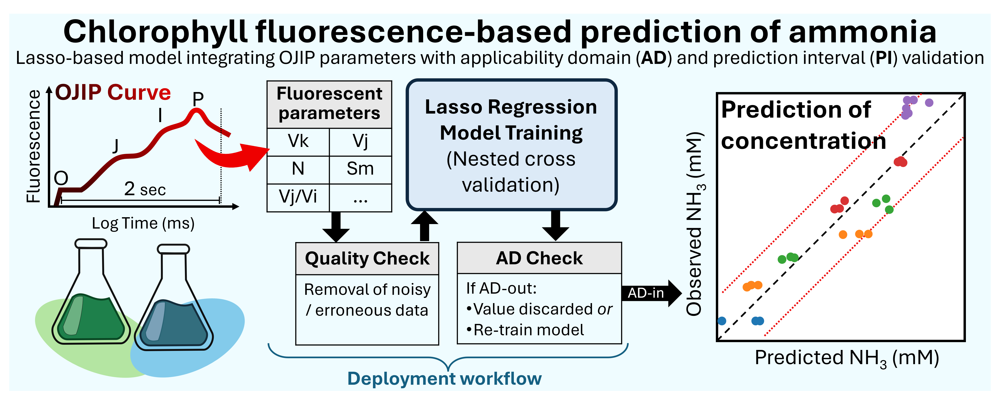
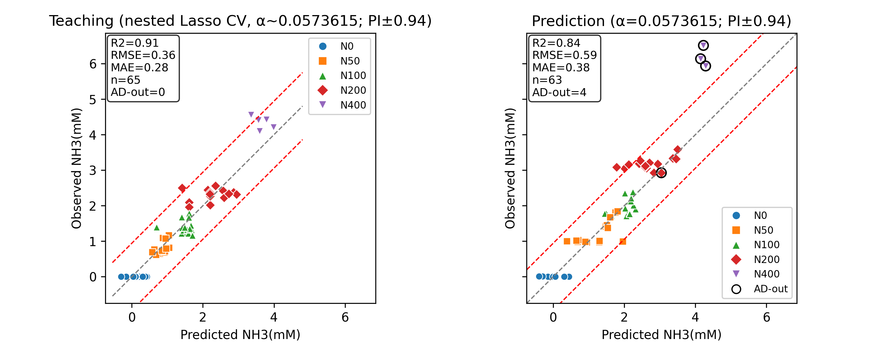

# Quick Prediction of Inhibiting Compounds with OJIP & Lasso Regression

[](https://www.python.org/)
[](LICENSE)
[]()

This folder contains a compact Python script that reproduces the minimum data-processing steps to predict photosynthetic inhibiting product (e.g., free ammonia) using OJIP parameters. It is written to be easy to read rather than feature complete.

This repository is part of the supporting information for [Reagent-Free Prediction of Free-Ammonia Toxicity in Algal Systems Using Chlorophyll Fluorescence Transients and Interpretable Sparse Regression](https://doi.org/10.1021/acs.est.5c18003) by Masatoshi Kishi, Panagiota Karachaliou, Tetsuichi Fujiki, Maki Noguchi Aita, and Raúl Muñoz.

---

## 📊 Overview



**Chlorophyll fluorescence-based prediction of ammonia:** This project implements a Lasso-based regression model that integrates OJIP parameters with applicability domain (AD) and prediction interval (PI) validation. The workflow extracts fluorescent parameters from OJIP curves, performs nested cross-validation, and provides robust concentration predictions with quality checks.

### Key Features

- 🔬 **OJIP Parameter Extraction** – Automated calculation of chlorophyll fluorescence transient parameters
- 📈 **Lasso Regression with Nested CV** – Robust feature selection using 1-SE rule
- ✅ **Applicability Domain Check** – Active-feature kNN distances with train-fold quantile thresholding
- 📉 **Prediction Intervals** – Statistical confidence bounds for each prediction
- 🎯 **High Accuracy** – R² = 0.91 (teaching), R² = 0.84 (prediction)

---

## 📑 Table of Contents

- [Overview](#-overview)
- [Results](#-results)
- [Files](#files)
- [Installation](#-installation)
- [Data Preparation](#-data-preparation)
- [Usage](#-usage)
- [Output Files](#-output-files)
- [Citation](#-citation)
- [License](#-license)

---

## 🎯 Results

### Example Results 



**Teaching Set (Nested Lasso CV):**
- R² = 0.91
- RMSE = 0.36 mM
- MAE = 0.28 mM
- AD-out = 4 samples

**Prediction Set:**
- R² = 0.84
- RMSE = 0.59 mM
- MAE = 0.38 mM
- AD-out = 2 samples

In the example available in this repository, the model successfully identifies samples outside the applicability domain, ensuring reliable predictions within the trained parameter space.

---

## 📁 Files

### Project Structure

```
OJIPLasso/
├── ojip_lasso_regression.py    # Main analysis pipeline
├── requirements.txt              # Python dependencies
├── README.md                     # This file
├── LICENSE                       # License information
├── CSV/                          # Input data folder
│   ├── Ao1.csv                  # OJIP measurements (species 1)
│   ├── Cv1.csv, Cv2.csv, Cv3.csv # OJIP measurements (species 2)
│   └── metadata.csv             # Sample metadata and labels
└── Output/                       # Generated results
    ├── smoothed_curves.csv
    ├── ojip_variables.csv
    ├── ojip_variables_with_metadata.csv
    ├── selected_features_coefficients.csv
    └── nh3_predicted_vs_observed_teach_pred.png
```

### Workflow Pipeline

The `ojip_lasso_regression.py` script executes the following steps:

1. **📥 Data Loading** – Reads metadata and AquaPen OJIP fluorescence files
2. **🔄 Signal Processing** – Applies spline smoothing to raw fluorescence curves
3. **🧮 Feature Extraction** – Calculates OJIP-derived photosynthetic parameters
4. **🎓 Model Training** – Nested cross-validation with Lasso regression (1-SE rule)
5. **🔍 Quality Control** – Applicability domain and prediction interval checks
6. **📊 Visualization** – Generates publication-quality prediction plots
7. **💾 Export** – Saves all processed data and model coefficients

### Cross-platform Support

- ✅ **Windows / macOS / Linux** – Fully cross-platform implementation
- ✅ **Relative paths** – Run from any directory (repository root recommended)
- ✅ **Headless compatible** – Non-interactive Matplotlib backend (Agg)
- ✅ **Reproducible** – All inputs from `CSV/`, all outputs to `Output/`

---

## 🔧 Installation

### Prerequisites

- Python 3.8 or higher
- pip package manager

### Quick Install

**Windows (PowerShell):**
```powershell
pip install -r requirements.txt
```

**Linux/macOS (bash/zsh):**
```bash
python3 -m pip install -r requirements.txt
```

### Virtual Environment (Recommended)

**Windows (PowerShell):**
```powershell
python -m venv .venv
.\.venv\Scripts\Activate.ps1
pip install -r requirements.txt
```

**Linux/macOS (bash/zsh):**
```bash
python3 -m venv .venv
source .venv/bin/activate
python3 -m pip install -r requirements.txt
```

---

## 📋 Data Preparation

This project expects AquaPen OJIP data in a strict "per-sheet wide" CSV format and a
metadata CSV that maps numeric MeasurementIDs to sample records.

### Per-sheet wide OJIP CSV (strict)

- The first column header (first cell) must be `index` for OJIP data.
- Subsequent column headers are numeric MeasurementIDs (for example `3`, `8`, `10`, ...),
  which typically corresponds to the 'index' value assigned by the AquaPen instrument.
- The file uses three header rows:
  1. `index` (first cell)
  2. `time` — per-column run timestamps for each measurement
  3. `id` — should contain the literal `OJIP` for each measurement column
- Data rows start on row 4 and contain numeric fluorescence values indexed by microseconds
  (typically starting near 11 µs and ending near 2,001,621 µs).
- If a single experiment contains multiple species or timepoints, split them into separate
  per-sheet CSV files (for example `Cv1.csv`, `Ao1.csv`) and place them under `CSV/`.

Example file (for reference): `CSV/Ao1.csv`.

### Metadata mapping (`CSV/metadata.csv`)

Provide a metadata CSV that maps numeric `MeasurementID` values to sample properties.
Required columns: `Species`, `Condition`, `Replicate`, `TimeLabel`, `Time`, `NH3_mM`, `MeasurementID`, `OJIPFile`.
Optional columns: `Notes`.

`MeasurementID` must be numeric and match one of the measurement column headers in the per-sheet CSV.
Typically, this is the index assigned by the AquaPen instrument. The included `CSV/metadata.csv` is
prefilled with example Cv/Ao samples — update `MeasurementID`, `NH3_mM`, and `OJIPFile` as needed.
`NH3_mM` is the target for regression in this release.

## 🚀 Usage

### Step 1: Prepare Your Data

Ensure your AquaPen per-sheet OJIP CSVs and `CSV/metadata.csv` follow the [Data Preparation](#-data-preparation) section above.

### Step 2: Configure Training/Prediction Groups

Edit `DATA_TEACH` and `DATA_PRED` near the top of `ojip_lasso_regression.py` to specify the exact sample combinations for teaching and prediction groups. Each entry is a dictionary matching metadata columns.

The core AD helper uses `ad_weight_mode='abs_coef'` by default, so the active-feature AD score is coefficient-weighted unless you override it in the call site.

### Step 3: Run the Analysis

**Windows (PowerShell):**
```powershell
python ojip_lasso_regression.py
```

**Linux/macOS (bash/zsh):**
```bash
python3 ojip_lasso_regression.py
```

> 💡 **Note:** The script uses relative paths and can be executed from any directory, but running from the repository root is recommended for clarity.

### Step 4: Review Results

All outputs are saved to the `Output/` folder:
- ✅ `smoothed_curves.csv`
- ✅ `ojip_variables.csv`
- ✅ `ojip_variables_with_metadata.csv`
- ✅ `selected_features_coefficients.csv`
- ✅ `nh3_predicted_vs_observed_teach_pred.png`

---

## 📤 Output Files

| File | Description |
|------|-------------|
| `smoothed_curves.csv` | Spline-smoothed fluorescence transients |
| `ojip_variables.csv` | Calculated OJIP parameters for all samples |
| `ojip_variables_with_metadata.csv` | OJIP parameters merged with sample metadata |
| `selected_features_coefficients.csv` | Lasso model coefficients for selected features |
| `nh3_predicted_vs_observed_teach_pred.png` | Prediction scatter plot with AD/PI validation |

---

## 📖 Citation

If you use this code in your research, please cite:

```bibtex
@software{ojiplasso2024,
  author = {Your Name},
  title = {Quick Prediction of Inhibiting Compounds with OJIP & Lasso Regression},
  year = {2024},
  url = {https://github.com/MasaK2010/OJIPLasso}
}
```

---

## 📄 License

This project is licensed under the MIT License - see the [LICENSE](LICENSE) file for details.

---

## 🤝 Contributing

Contributions, issues, and feature requests are welcome! The script intentionally avoids optional arguments or extensive error handling to keep the logic transparent for readers who are new to Python.

---

## 👤 Author

**MasaK2010**
- GitHub: [@MasaK2010](https://github.com/MasaK2010)

---

<div align="center">
  
**⭐ If you find this project useful, please consider giving it a star! ⭐**

</div>
